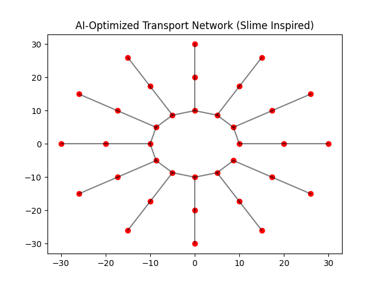

# Oraculum Urban AI Transport (V1)

This project explores a bio-inspired approach to designing optimized transportation systems for future cities.

## Concept

Inspired by:
- The Venus Project (Jacque Fresco)
- Slime mold optimization (Physarum Polycephalum)
- AI-driven infrastructure
- Autonomous mobility systems

We simulate a circular city and generate efficient transport networks using graph optimization.

## Features

- Circular city generation (multi-ring structure)
- Slime mold-inspired network optimization (Minimum Spanning Tree)
- Node-based transport modeling
- Visualization of transport routes

## Features

- Circular city generation (multi-ring topology)
- Node-based transport modeling
- Bio-inspired network optimization (Minimum Spanning Tree)
- Visual simulation of transport routes

## V1 Output

## Technical Stack

- Python
- NumPy
- NetworkX
- SciPy
- Matplotlib

## Run the project

pip install -r requirements.txt
python src/main.py

## Roadmap

Next iterations:

- Traffic simulation (dynamic weights)
- Demand-based nodes (hospitals, business centers)
- Multi-objective optimization (time, cost, energy)
- Autonomous vehicle simulation layer
- Interactive dashboard (Streamlit)

## Vision

This is the first step toward:

- Fully autonomous, AI-managed cities where transportation is 
- Safer (near-zero accidents)
- More efficient (optimized routes)
- Accessible (globally scalable systems)

## Author

Leandro Coronel
Applied AI Engineer | Oraculum Systems
